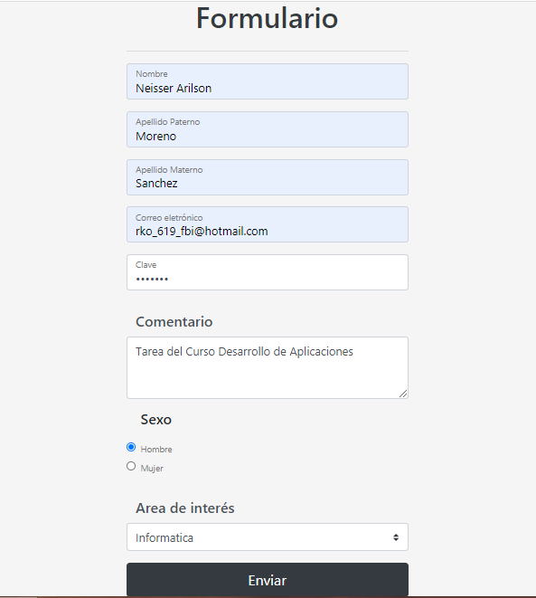
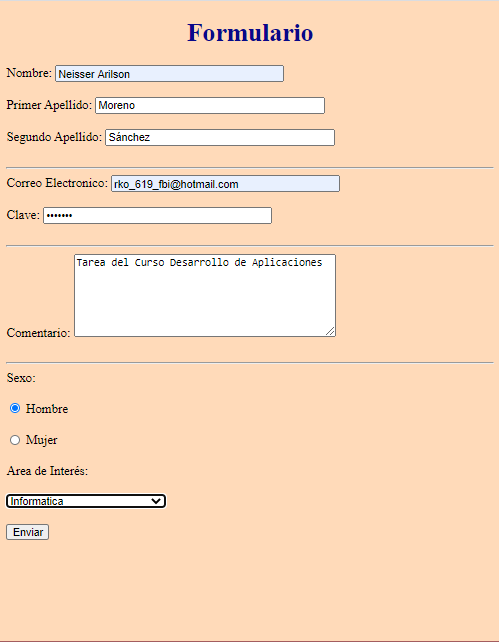
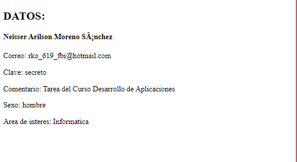

 # Java Web Form (html, css and bootstrap)

 Tarea del curso Desarrollo de Aplicaciones (UPAO), uno es usando boostrap y el otro es tal cual pidió el profesor.

 #### Formulario usando Bootstrap

 

 #### Formulario sin Bootstrap

 

#### Muestra

> Visita mi blog (Ko-fi) y podrás encontrar documentos de los proyectos que he hecho hasta ahora, como por ejem: Inso l, Inso ll, Base de Datos, Arqui de Comp, Redes, etc.

Click abajo  :heart_eyes: :heart:

